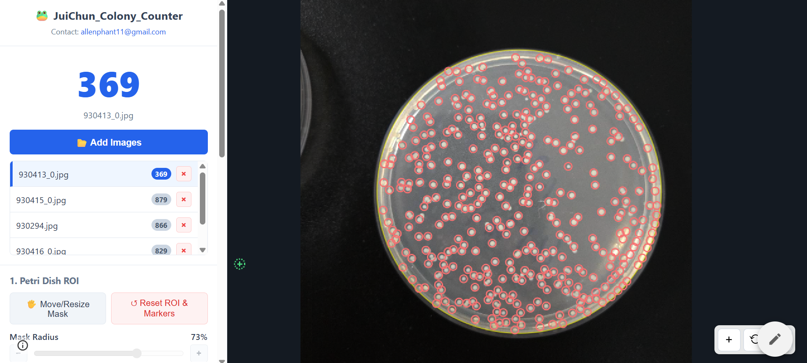
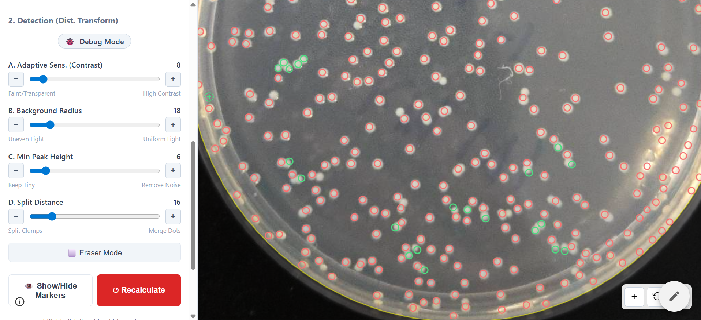

# JuiChun_Colony_Counter

基於網頁技術與電腦視覺的自動化菌落計數系統 (Colony Counter)。

---

### 🚀 [立即試用 (Live Demo)](https://sites.google.com/view/juichun-colony-counter-v1/colony-counter)

---

## 1. 產品概述 (Overview)

JuiChun Colony Counter 是一款專為微生物實驗室設計的輕量級網頁應用程式。無需安裝、不依賴後端伺服器，直接在瀏覽器中透過 HTML5 Canvas 與現代 JavaScript 演算法進行菌落計數。

**v1.3 核心特色：** 針對「光照不均」與「菌落沾黏」進行優化，採用自適應閾值演算法，模擬人眼對局部對比度的感知，大幅提升在複雜光源下的辨識準確度。

## 2. 標準操作流程 (SOP)

### 第一步：匯入與設定範圍
1. **上傳影像**：點擊 `📂 Add Images` 匯入照片。
2. **設定 ROI**：
   - 點擊 `🖐️ Move/Resize Mask`。
   - 調整 **Mask Radius** 或拖曳黃色圓圈，使其剛好包住培養基，切掉盤子邊緣的反光。
   - 點擊 `✅ Done Editing`。

*(圖：Demo1 - 匯入檔案與調整圈選範圍)*

### 第二步：校正與微調
1. **參數校正 (Debug Mode)**：
   - 開啟 `🐞 Debug Mode` 並切換到 `⚫ Binary` 視圖。
   - 調整 **Sensitivity** 直到黑白分明（菌落白色，背景黑色）。
2. **細部微調**：
   - 若有雜訊，提高 **Min Peak Height**。
   - 若有沾黏沒切開，降低 **Split Distance**。

### 第三步：人工修正與匯出
1. **人工修正**：
   - 點擊漏掉的菌落（新增綠點）。
   - 點擊誤判的雜訊（刪除紅點）。
   - 按住 `Ctrl` 拖曳滑鼠，批量擦除錯誤標記（橡皮擦模式）。
2. **輸出**：點擊 `📊 CSV` 或 `🖼️ Image` 下載結果。

*(圖：Demo2 - 參數調整與手動新增/刪除)*

---

## 3. 參數調整指南 (Tuning Guide)

當自動計數不準確時，請依照以下順序調整：

### A. Adaptive Sensitivity (自適應靈敏度)
- **定義**：菌落需要比「背景」亮多少？
- **調低 (左)**：條件寬鬆，適合菌落色淡、透明的情況。
- **調高 (右)**：條件嚴格，只抓取高對比度菌落。

### B. Background Radius (背景半徑)
- **建議值**：設定為比單個菌落稍大。
- **調小**：強大適應局部光線變化，但過小可能導致大菌落「空心」。
- **調大**：適合處理大塊菌落，但對抗光照不均的能力減弱。

### C. Min Peak Height (最小峰值高度)
- **作用**：主要的雜訊過濾器。
- **解法**：若畫面充滿沙狀小點，調高此數值直到小點消失。

### D. Split Distance (分離距離)
- **作用**：處理 8 字型沾黏。
- **調低**：積極切開沾黏菌落（適合高密度小菌落）。
- **調高**：傾向合併靠近的點。

---

## 4. 技術規格 (Technical Spec)

- **架構**：SPA 純前端 HTML/CSS/JS (Vanilla JS)。
- **核心演算法**：
  - **Integral Image**：快速取得區域平均亮度。
  - **Adaptive Thresholding**：產生自適應前景遮罩。
  - **Distance Transform**：建立地形圖以處理沾黏。
  - **Local Maxima / NMS**：精確定位菌落中心。
- **資料隱私**：所有影像處理皆在本地記憶體完成，圖片不會上傳至伺服器。

## 5. 功能清單 (Features)

- **即時預覽**：參數調整即刻生效。
- **歷史紀錄**：支援 `Ctrl+Z` 復原所有操作。
- **多圖管理**：支援批量上傳與獨立參數保留。
- **互動標記**：點擊增刪、批量刪除 (Eraser Mode)。

## 聯絡資訊

開發者：JuiChun
Email: allenphant11@gmail.com
